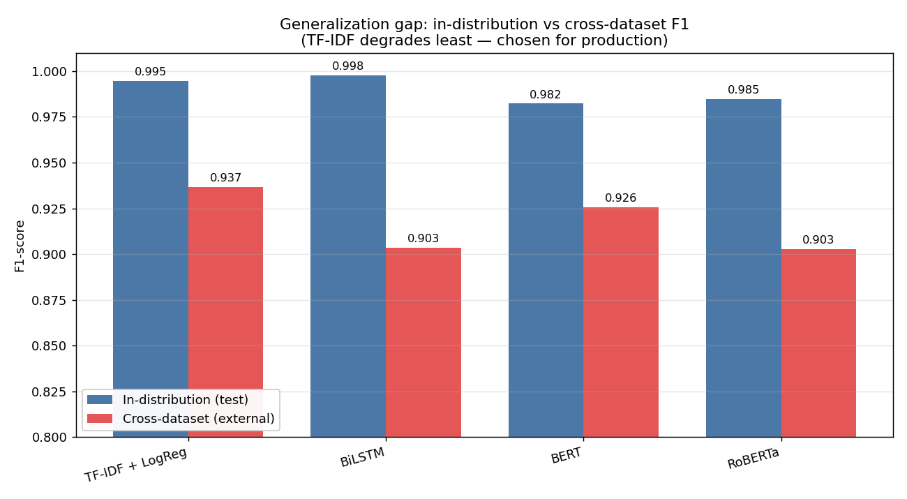

# AI vs Human Text Detection

[](https://github.com/chandanamahesh15/Robust-AI-Generated-Text-Detection/actions/workflows/ci.yml)


Classifies a passage of text as **human-written** or **AI-generated**, and ships
the chosen model behind a REST API.

The repository is deliberately split into two tracks:

- **Production track** — a lightweight **TF-IDF + Logistic Regression** model that
  trains in seconds on CPU, weighs ~1 MB, and serves predictions in milliseconds
  via FastAPI. This is the deployable artifact.
- **Research track** — a reproducible benchmark of five model families
  (majority/stratified baselines, TF-IDF+LogReg, a from-scratch BiLSTM, fine-tuned
  BERT & RoBERTa, and frozen Qwen2.5 embeddings + LogReg) that *justifies* the
  production choice, plus external validation on an unseen dataset.

> **Why this matters.** As AI-generated text proliferates, schools, publishers,
> and platforms need a fast, cheap, auditable first-pass filter. A 400 MB
> transformer that needs a GPU is the wrong tool for a high-throughput screening
> step; a 1 MB CPU model that captures most of the signal is the right one. This
> project shows that trade-off being measured and then engineered into a service.

---

## Results

Five model families were benchmarked on identical splits, then validated on an
**unseen external dataset** (`reports/benchmark_results.csv`). In-distribution,
everything scores 0.98–0.998 F1, so it doesn't separate the models. The deciding
metric is cross-dataset generalization — the honest proxy for production behaviour.

| Model | Test F1 (in-dist.) | **External F1** | External accuracy |
|---|---|---|---|
| **TF-IDF + LogReg** ⭐ deployed | 0.9945 | **0.9366** | **0.8917** |
| BERT (fine-tuned) | 0.9822 | 0.9257 | 0.8697 |
| BiLSTM (scratch embed) | 0.9977 | 0.9034 | 0.8438 |
| RoBERTa (fine-tuned) | 0.9846 | 0.9026 | 0.8241 |
| Qwen2.5-0.5B + LR (frozen) | 0.9852 | — | — |
| Stratified baseline | 0.3749 | — | — |



**The finding that drives the design:** the compact TF-IDF model generalizes
*best* to unseen data while being the cheapest to run. The fine-tuned
transformers overfit the training distribution's stylistic tells and degrade more
under domain shift (RoBERTa's human-class recall collapses to ~0.05 externally —
it labels almost everything "AI"). So TF-IDF is **chosen on evidence**, not by
default — and the heavy models stay in the repo as the benchmark that proves it.

> One caveat stated plainly: the >0.99 in-distribution scores indicate an *easy*
> dataset. The ~10-point external drop is the realistic number. See
> [`artifacts/model_card.md`](artifacts/model_card.md).

| Concern | Deployed (TF-IDF) | Heavy transformers |
|---|---|---|
| Inference hardware | CPU | GPU preferred |
| Artifact size | ~1 MB | 400 MB+ |
| Cold start | milliseconds | seconds |
| Retrain time | seconds | hours |
| External F1 | **0.937** | 0.90–0.93 |

---

## Project structure

```
.
├── app/
│   └── main.py              # FastAPI inference service (serves the TF-IDF artifact)
├── config/
│   └── config.yaml          # ALL parameters: paths, columns, hyperparameters
├── src/
│   ├── config.py            # Typed config loader (dataclasses + env overrides)
│   ├── logging_utils.py     # Centralized logging (replaces print)
│   ├── data.py              # Load / clean / stratified split
│   ├── features.py          # EDA length features (analysis only)
│   ├── evaluate.py          # Pure metrics + separate plotting helpers
│   ├── pipeline.py          # CLI: train + save the DEPLOYED model
│   ├── benchmark.py         # CLI: reproduce the multi-model comparison
│   ├── external_validation.py
│   └── models/
│       ├── tfidf.py         # Deployable model (train/save/load/predict)
│       ├── bilstm.py        # Research: Keras BiLSTM
│       ├── transformer.py   # Research: BERT/RoBERTa fine-tuning
│       └── qwen_features.py # Research: frozen Qwen embeddings + LogReg
├── tests/                   # pytest suite
├── notebooks/               # EDA + the full multi-model benchmark (exploration only)
├── reports/                 # Captured benchmark results (CSV + chart)
├── artifacts/               # Trained model, vectorizer, metrics, model card
├── data/
│   ├── raw/                 # Source AI_Human.csv.zip lives here
│   └── extracted/           # Auto-extracted CSV (gitignored)
├── Dockerfile               # Slim CPU serving image (no torch/TF)
├── .dockerignore
├── .github/workflows/ci.yml # Lint + test + docker-build on push/PR
├── requirements.txt         # Core + serving deps
├── requirements-research.txt# Heavy GPU deps (torch/tf/transformers)
├── pyproject.toml           # Packaging, entry points, tool config
└── Makefile                 # install / train / benchmark / serve / test / lint
```

**Design principle:** the serving path imports nothing from `src/models/` except
`tfidf.py`, so the production container never pulls in torch or tensorflow.

---

## Installation

Requires Python 3.10+.

```bash
git clone https://github.com/chandanamahesh15/Robust-AI-Generated-Text-Detection.git
cd Robust-AI-Generated-Text-Detection

python -m venv .venv && source .venv/bin/activate   # Windows: .venv\Scripts\activate

# Core + dev tooling (training the deployable model, serving, tests)
pip install -e ".[dev,viz]"
# or: pip install -r requirements.txt

# Only if you want to reproduce the heavy research models:
pip install -e ".[research]"
```

### Dataset

The model is trained on the **[AI Vs Human Text](https://www.kaggle.com/datasets/shanegerami/ai-vs-human-text)**
dataset from Kaggle (~500K essays labelled human vs. AI). It is **not committed
to this repo** — at ~344 MB it exceeds GitHub's file limit, and large data
doesn't belong in version control.

To train from scratch, download it from the link above and place the archive at:

```
data/raw/AI_Human.csv.zip
```

The CSV must contain a `text` column and a binary `generated` column (0 = human,
1 = AI). The path and column names are configurable in `config/config.yaml`.

> The repo ships with a pre-trained model in `artifacts/`, so you can run the API
> **without** the dataset. You only need the data to retrain or re-run the benchmark.

---

## Usage

### Train the deployable model

```bash
make train
# equivalently:
python -m src.pipeline --config config/config.yaml
```

This loads the data, makes a stratified 70/15/15 split, trains TF-IDF + LogReg,
logs validation/test metrics, and writes `artifacts/`:
`tfidf_logreg_model.joblib`, `tfidf_vectorizer.joblib`, `tfidf_metrics.csv`.

### Run with different parameters (no code changes)

```bash
# Edit config/config.yaml, OR override per-run via environment variables:
AVH__TFIDF__MAX_FEATURES=20000 AVH__TFIDF__NGRAM_MAX=3 python -m src.pipeline
```

### Serve predictions

```bash
make serve   # uvicorn app.main:app --port 8000
```

```bash
curl -X POST localhost:8000/predict \
     -H "Content-Type: application/json" \
     -d '{"text": "Furthermore, it is important to note that..."}'
# -> {"predictions":[{"label":1,"ai_probability":0.91}]}
```

### Tests & static checks

```bash
make test    # pytest with coverage
make lint    # ruff + mypy
```

### Reproduce the multi-model benchmark

```bash
python -m src.benchmark --skip-heavy   # baselines + TF-IDF only (CPU, seconds)
python -m src.benchmark                # full comparison (needs .[research] + GPU)
```

Baselines and TF-IDF always run; the GPU models run only if their libraries are
installed and are skipped with a clear log otherwise. Results are written to
`reports/benchmark_results.csv`.

### Run with Docker

The image installs only the serving dependencies — no torch/tensorflow — so it
stays small. Train once to produce `artifacts/`, then build and run:

```bash
make train                                  # produces artifacts/*.joblib
docker build -t ai-vs-human-detector .
docker run -p 8000:8000 ai-vs-human-detector
curl -X POST localhost:8000/predict -H "Content-Type: application/json" \
     -d '{"text": "..."}'
```

### Continuous integration

`.github/workflows/ci.yml` runs on every push and PR:

- **test** — pytest across Python 3.10/3.11/3.12 with coverage
- **lint** — ruff (style + unused imports) and mypy on the production path
- **docker** — builds the serving image as a smoke test

---

## Engineering notes

- **Configuration over hardcoding.** Every path, column name, and hyperparameter
  lives in `config/config.yaml` and loads into typed dataclasses; env vars
  override file values for deployment without touching source.
- **Leakage guards** (preserved from the original analysis): duplicate texts are
  dropped *before* splitting; the vectorizer, tokenizer, and scaler are each fit
  on the training split only; splits are stratified and seeded for reproducibility.
- **Separation of compute and presentation.** Metric functions are pure and
  return dicts (unit-tested); plotting is isolated so the serving image needs no
  GUI backend.
- **Logging, not prints.** All modules use the standard `logging` library through
  one configured root logger.
- **Type hints throughout** for editor support and `mypy` checking.

---

## License

MIT — see [LICENSE](LICENSE).
